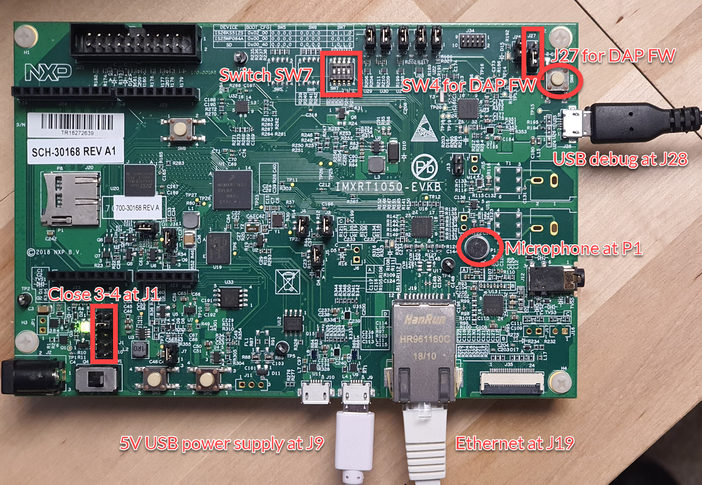

# Arm DevSummit 2021: Introducing Keil Studio

Successful IoT implementations require collaboration and a robust ecosystem of support and tools. Keil Studio cloud embraces the Open-CMSIS-Pack initiative and provides a cloud-native platform with direct Git integration for collaboration of distributed teams, and modern CI workflows for rapid development.

This introductory workshop allows attendees to experience the workflow first-hand. They will prototype an IoT end node application, connect it to the cloud, and debug it via their browser.

## Required hardware

For the best workshop experience, you'll need the following:

- [NXP IMXRT1050-EVKB](https://www.keil.arm.com/hardware/IMXRT1050-EVKB/) (if you don’t have the hardware, you can still follow most of the workshop).
- Ethernet cable long enough to connect the board to your router.
- 5V USB power supply with Micro-USB cable to supply the dev board.

If you do not have access to the board, you can still follow much of the workshop. Debug will be demonstrated by the facilitators of the workshop.

### Basic hardware setup for the workshop

- Close **3-4** on jumper block **J1** (bottom left corner of the board).
- Attach the 5V USB power supply at **J9** (next to the Ethernet receptacle).
- Connect your computer to the development board at **J28** (top right corner of the board).

## Pre-work

For jumpers, switches, and cable connections refer to the image above!

### CMSIS-DAP Firmware

Make sure that you have updated your CMSIS-DAP firmware to the latest version. This makes the board compatible with [Keil Studio Cloud](https://keil.arm.com) that enables browser-based project creation and debugging. The following instructions apply if your board is equipped with a Kinetis K20DX device (marked as M20AGV) at U23.

#### Using HyperFlash

If your board is configured for HyperFlash (**SW7** is set to **OFF/ON/ON/OFF**), use the following CMSIS-DAP firmware: [DAPLink 0254](./DAPLink/0254_k20dx_mimxrt1050_evk_hyper_0x8000.bin)

#### Using QSPI Flash

If your board is configured for QSPI Flash (**SW7** is *not set* to **OFF/ON/ON/OFF**), use the following CMSIS-DAP firmware: [DAPLink 0254](./DAPLink/0254_k20dx_mimxrt1050_evk_qspi_0x8000.bin)

#### Jumper settings

Close **1-2** on jumper block **J27** (top right corner of the board). 

**Flashing instructions for Windows users**

1. While holding down the **SW4** button, connect the boards USB debug port to the computer. It should enumerate and mount as **MAINTENANCE**.
1. Drag-and-drop the firmware file onto the mounted drive.
1. Wait for the file copy operation to complete.
1. Power cycle the board. It will now enumerate and mount as DAPLINK or the name of the board.

**Flashing instructions for Linux users**

1. While holding down the **SW4** button, connect the boards USB debug port to the computer. It should enumerate as MAINTENANCE.
1. In a terminal execute  
   `cp <path to firmware file> <MAINTENANCE> && sync`  
   *Note*: make sure to change MAINTENANCE to the name of the mount point of the drive on your system.
1. Power cycle the board. It will now enumerate and mount as DAPLINK or the name of the board.

**Flashing instructions for MAC users**

1. While holding down the **SW4** button, connect the boards USB debug port to the computer. It should enumerate as MAINTENANCE.
1. In a terminal execute  
   `sudo mount -u -w -o sync /Volumes/MAINTENANCE ; cp -X <path to firmware file> /Volumes/MAINTENANCE/`  
   *Note*: If your drive does not mount as MAINTENANCE make sure to change this to match the name of the mounted disk attached to your system.
1. Wait for the file copy operation to complete.
1. Power cycle the board. It will now enumerate and mount as DAPLINK or the name of the board.

- Keil Studio Cloud runs in a browser. You need a Chromium based browser (Chrome/Edge - no matter if you run Windows, Mac, or Linux).
- Create a user account at [studio.keil.arm.com](studio.keil.arm.com) and ensure you can login. If you have an Arm or Mbed account, you can use these to access the site.
- We recommend a dual monitor setup, so that you can see the workshop and your Keil Studio workspace at the same time.

## Optional pre-work

Two of the projects shown in the workshop require additional accounts being set up:

- Set up a [GitHub](https://www.github.com) account for forking one of the example projects.
- Set up an AWS account if you want to follow the last step in the tutorial:
  - Create an account at [aws.amazon.com](aws.amazon.com).
  - For the workshop, you need to configure a Thing in the AWS IoT console. You also need to have copies of your client certificate and private key available. For creation, follow [these instructions](https://github.com/MDK-Packs/Documentation/tree/master/AWS_Thing).

## Slides

The [slide deck]() contains screenshots of the workshop. Use it to recreate the workshop in your own pace.

## Further reading

Here's a list of additional resources that you may find useful:

- A DevSummit session that explains the background of the workshop: [CI/CD and MLOps workflow for IoT endpoint development](https://devsummit.arm.com/en/sessions/145)
- A blog, similar to the above: [Cloud-based embedded development to supercharge IoT](https://www.arm.com/blogs/blueprint/cloud-based-embedded-development)
- Blog about [Cloud infrastructure for continuous integration tests](https://community.arm.com/developer/tools-software/tools/b/tools-software-ides-blog/posts/infrastructure-for-continuous-integration-tests)

## Feedback

If you want to get in touch, please raise an issue or send in a PR.
